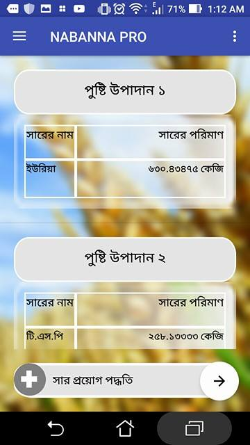

# NABANNAPRO
Every year, soil fertility of our country become decreases because of not applying recommended amount of fertilizer. Besides applying excess amount of fertilizer production cost of crops increases. Application nabanna comes with this idea so that farmers can solution these problems themselves. 
This application has been developed by following “Fertilizer Recommendation Guide-2012” . All the data sources are collected by following FRG-2012. 
Current Screenshot of the application: 

 
<h4 >INPUT PHASE</h4>

 
<h4 >OUTPUT PHASE</h4>

